<div align="center">

<!-- ANIMATED HEADER WITH GRADIENT WAVE -->
<picture>
  <source media="(prefers-color-scheme: dark)" srcset="https://capsule-render.vercel.app/api?type=waving&color=gradient&customColorList=6,12,20,24&height=300&section=header&text=TeraSystemsAI&fontSize=90&fontColor=fff&animation=twinkling&fontAlignY=38&desc=Empowering%20Physicians%20|%20Saving%20Lives%20|%20Advancing%20Healthcare&descAlignY=55&descSize=20">
  <source media="(prefers-color-scheme: light)" srcset="https://capsule-render.vercel.app/api?type=waving&color=gradient&customColorList=0,2,6,12,20&height=300&section=header&text=TeraSystemsAI&fontSize=90&fontColor=fff&animation=twinkling&fontAlignY=38&desc=Empowering%20Physicians%20|%20Saving%20Lives%20|%20Advancing%20Healthcare&descAlignY=55&descSize=20">
  
</picture>

<!-- ANIMATED TYPING EFFECT -->
<a href="https://git.io/typing-svg">
  
</a>

<br/>

<!-- PREMIUM STATUS BADGES WITH ANIMATIONS -->
<p align="center">
  <a href="https://www.terasystems.ai">
    
  </a>
  <a href="https://github.com/TeraSystemsAI">
    
  </a>
  <a href="https://www.terasystems.ai">
    
  </a>
  <a href="https://www.terasystems.ai">
    
  </a>
</p>

<!-- COMPACT STATUS INDICATORS -->
<p align="center">
  
  
  
  
  
</p>

<!-- SOCIAL PROOF -->
<p align="center">
  
  
  
</p>

</div>

<!-- GRADIENT DIVIDER -->


<br/>

<!-- MISSION STATEMENT IN ELEGANT BOX -->
<div align="center">

<table>
<tr>
<td width="100%">

<div align="center">

## 🎯 Our Mission

<br/>

### *"Empowering physicians in their noble mission to save lives through cutting-edge, uncertainty-aware AI"*

<br/>

We develop advanced **Bayesian Neural Networks (BNNs)**, **Convolutional Neural Networks (CNNs)**, **Transformers**, and **Time Series models** that provide physicians with **trustworthy, calibrated predictions** for **life-or-death medical decisions**.

<br/>


</div>

</td>
</tr>
</table>

</div>

<br/>

<!-- ANIMATED SEPARATOR -->


<br/>

## 🏥 Why Healthcare Organizations Choose Us

<div align="center">

<table>
<tr>
<td width="33%" align="center">


### 🛡️ **Trustworthy AI**

<br/>

**AI that knows when it doesn't know**

Our uncertainty quantification ensures physicians receive:
- ✅ **Calibrated confidence scores**
- ⚠️ **Explicit uncertainty metrics**
- 🎯 **Risk-aware predictions**

<br/>


</td>
<td width="33%" align="center">


### 🏥 **Clinical Validation**

<br/>

**Rigorously tested in real healthcare settings**

Our systems are deployed in:
- 🏥 **12+ major hospitals**
- 👨‍⚕️ **200+ physicians trained**
- 🌍 **Multi-center validation**

<br/>


</td>
<td width="33%" align="center">


### 📈 **Proven Impact**

<br/>

**Measurable improvements in patient outcomes**

Real-world results:
- 💊 **50,000+ patients** impacted
- 🎯 **1,200+ early detections**
- ⏱️ **18% ICU mortality** reduction

<br/>


</td>
</tr>
</table>

</div>

<br/>

<!-- ANIMATED SEPARATOR -->


<br/>

## 🔬 Our AI Technology Portfolio

<div align="center">

### *Four Pillars of Medical AI Excellence*

```mermaid
%%{init: {'theme':'dark', 'themeVariables': { 'fontSize':'16px'}}}%%
graph TD
    A[🧠 Bayesian Neural Networks<br/>Uncertainty Quantification] -->|Trustworthy Predictions| E[🏥 Clinical Decision Support]
    B[🔍 Convolutional Neural Networks<br/>Medical Imaging] -->|Visual Analysis| E
    C[🤖 Transformers<br/>Clinical Intelligence] -->|NLP & Understanding| E
    D[📊 Time Series Models<br/>Patient Monitoring] -->|Predictive Analytics| E
    E -->|Empowering| F[👨‍⚕️ Physicians Save Lives]
    
    style A fill:#2962FF,stroke:#fff,stroke-width:2px,color:#fff
    style B fill:#00C853,stroke:#fff,stroke-width:2px,color:#fff
    style C fill:#FF6D00,stroke:#fff,stroke-width:2px,color:#fff
    style D fill:#E53935,stroke:#fff,stroke-width:2px,color:#fff
    style E fill:#9C27B0,stroke:#fff,stroke-width:3px,color:#fff
    style F fill:#FFD700,stroke:#fff,stroke-width:3px,color:#000
```

<br/>



</div>

<br/>

<table>
<tr>
<td width="25%" align="center">


### 🧠 Bayesian Neural Networks


<br/>

**🎯 Core Capabilities**
```diff
+ Monte Carlo Dropout
+ Variational Inference  
+ Epistemic Uncertainty
+ Aleatoric Uncertainty
+ Calibrated Confidence
```

<br/>

**💊 Clinical Impact**

Physicians know **exactly when AI is uncertain**, enabling **safer decisions** and preventing dangerous over-reliance

<br/>


<br/>


</td>
<td width="25%" align="center">


### 🔍 CNNs for Medical Imaging


<br/>

**🎯 Core Capabilities**
```diff
+ Radiology Interpretation
+ Pathology Analysis
+ Surgical Guidance
+ Tumor Detection
+ Segmentation
```

<br/>

**💊 Clinical Impact**

**Early disease detection** through advanced imaging catches conditions **months earlier**, dramatically improving survival rates

<br/>


<br/>


</td>
<td width="25%" align="center">


### 🤖 Transformers


<br/>

**🎯 Core Capabilities**
```diff
+ Medical Record NLP
+ Drug Interactions
+ Treatment Planning
+ Clinical Q&A
+ Literature Synthesis
```

<br/>

**💊 Clinical Impact**

**Personalized medicine** at scale through intelligent analysis of patient history and medical literature

<br/>


<br/>


</td>
<td width="25%" align="center">


### 📊 Time Series Models


<br/>

**🎯 Core Capabilities**
```diff
+ Vital Sign Prediction
+ ICU Forecasting
+ Early Warning Systems
+ Sepsis Detection
+ Outcome Prediction
```

<br/>

**💊 Clinical Impact**

**Proactive intervention** detects complications **4-6 hours early**, reducing ICU mortality by **18%**

<br/>


<br/>


</td>
</tr>
</table>

<br/>

<!-- ANIMATED SEPARATOR -->


<br/>

## 🚀 Flagship Project: Bayesian RAG

<div align="center">

<a href="https://github.com/TeraSystemsAI/bayesian-rag">
  
</a>

<br/><br/>

### 🎯 **Uncertainty-Aware Clinical Decision Support System**

<br/>

<p>
  <a href="https://github.com/TeraSystemsAI/bayesian-rag"></a>
  <a href="https://arxiv.org/abs/2024.xxxxx"></a>
  <a href="https://www.terasystems.ai/demo"></a>
  <a href="https://www.terasystems.ai/security"></a>
</p>

</div>

<br/>

<table>
<tr>
<td width="50%">

### 📊 **World-Class Performance**

<br/>

| Metric | Score | Benchmark |
|:-------|:------|:----------|
| **F1 Score** |  | <span style="color:green">▲ 8.9%</span> vs GPT-4 |
| **Calibration (ECE)** |  | Near-perfect |
| **Precision** |  | Clinical grade |
| **Recall** |  | Comprehensive |
| **Brier Score** |  | Excellent |

<br/>

**🔬 Technical Excellence:**
```python
✓ Monte Carlo Dropout
✓ Bayesian Embeddings
✓ GPU Acceleration
✓ Docker + Kubernetes
✓ Real-time Inference
✓ HIPAA Architecture
```

<br/>

**📈 Deployment Status:**
- ✅ **3 major academic hospitals** (pilot)
- ✅ **85+ physicians** certified
- ✅ **15,000+ clinical queries** processed
- ✅ **99.2% safety** validation

</td>
<td width="50%">

### 💊 **Revolutionary Clinical Applications**

```mermaid
%%{init: {'theme':'dark'}}%%
mindmap
  root((Bayesian<br/>RAG))
    🩺 Treatment<br/>Recommendations
      Evidence synthesis
      Confidence bounds
      Rare conditions
      Clinical guidelines
    💊 Drug<br/>Interactions
      Multi-drug analysis
      Risk quantification
      Personalized alerts
      Contraindication detection
    📋 Literature<br/>Synthesis
      Real-time updates
      Reliability scores
      Meta-analysis
      Systematic reviews
    🚨 Critical<br/>Care
      Emergency decisions
      Uncertainty metrics
      ICU support
      Time-critical guidance
```

<br/>



<br/>

**🏆 Clinical Use Cases:**

<table>
<tr>
<td>🩺</td>
<td><b>Evidence-Based Treatment</b><br/>Synthesizes literature with confidence</td>
</tr>
<tr>
<td>💊</td>
<td><b>Drug Safety Checking</b><br/>Identifies interactions with risk levels</td>
</tr>
<tr>
<td>📋</td>
<td><b>Medical Literature Q&A</b><br/>Processes knowledge with reliability</td>
</tr>
<tr>
<td>🚨</td>
<td><b>Critical Care Support</b><br/>Real-time emergency guidance</td>
</tr>
</table>

</td>
</tr>
</table>

<br/>

<!-- ANIMATED SEPARATOR -->


<br/>

## 🔬 Additional Cutting-Edge Projects

<div align="center">

<table>
<tr>
<td width="33%" align="center">


### 🩻 **BNN-Diagnostic Suite**


<br/>

*Bayesian CNNs for Medical Imaging*

**🎯 Features:**
- Uncertainty maps for radiology
- PACS system integration
- Real-time surgical guidance
- Multi-modal imaging

**💊 Impact:**  
Reduces false positives by **23%**

<br/>


</td>
<td width="33%" align="center">


### ❤️ **CardioPredict**


<br/>

*Transformer-Based CVD Risk*

**🎯 Features:**
- 10-year event prediction
- Uncertainty-aware risk stratification
- EHR integration ready
- Personalized interventions

**💊 Impact:**  
Early intervention for high-risk patients

<br/>


</td>
<td width="33%" align="center">


### 🫁 **ICU-Guardian**


<br/>

*Time Series Early Warning*

**🎯 Features:**
- Sepsis detection 4-6h earlier
- Real-time vital monitoring
- Alarm fatigue reduction
- Automated escalation

**💊 Impact:**  
**18% reduction** in ICU mortality

<br/>


</td>
</tr>
<tr>
<td width="33%" align="center">


### 🧠 **NeuroScope**


<br/>

*BNN Neurological Detection*

**🎯 Features:**
- Alzheimer's early detection
- Stroke risk assessment
- MS progression tracking
- Uncertainty-aware diagnosis

**💊 Impact:**  
Early intervention opportunities

<br/>


</td>
<td width="33%" align="center">


### 🔬 **PathologyAI**


<br/>

*Cancer Detection in Tissue*

**🎯 Features:**
- Uncertainty-aware classification
- Grade prediction with confidence
- Workload reduction 40%
- Second opinion system

**💊 Impact:**  
Faster, more accurate diagnoses

<br/>


</td>
<td width="33%" align="center">


### 💉 **DiabetesPredict**


<br/>

*Time Series Glucose Management*

**🎯 Features:**
- Hypoglycemia prediction (30-60min)
- Insulin dose optimization
- CGM integration
- Meal recommendations

**💊 Impact:**  
Better glucose control, fewer emergencies

<br/>


</td>
</tr>
</table>

<br/>

*All projects designed through physician collaboration for real-world clinical utility*

</div>

<br/>

<!-- ANIMATED SEPARATOR -->


<br/>

## 📚 Research Excellence & Publications

<div align="center">

<table>
<tr>
<td width="60%">

### 🎓 **Peer-Reviewed Publications**

<br/>

| Year | Title | Venue | Citations |
|:-----|:------|:------|:----------|
| **2025** | Bayesian Retrieval-Augmented Generation | arXiv | 🔥 Featured |
| **2025** | Enhancing Autonomous Systems with BNN | Frontiers | ✅ Published |
| **2025** | Hybrid Naïve Bayes for Scam Detection | IEEE Access | [📄 DOI](https://doi.org/10.1109/ACCESS.2025.3569216) |
| **2024** | BNN in Healthcare: Three Case Studies | MAKE | [📄 DOI](https://doi.org/10.3390/make6040127) |
| **2024** | Optimization Techniques Comparative Study | OJOP | [📄 DOI](https://doi.org/10.4236/ojop.2024.133004) |

<br/>

**📊 Research Impact:**
- 📈 **Growing citation** count
- 🏆 **Top-tier venues** (IEEE, Frontiers, arXiv)
- 🌍 **International recognition**
- 🔬 **Industry adoption**

</td>
<td width="40%" align="center">

<br/>


<br/><br/>

### 🏆 **Recognition**

<br/>


<br/><br/>

**🔗 Research Profiles:**

<a href="https://www.researchgate.net/profile/Lebede-Ngartera"></a>

<a href="https://scholar.google.com"></a>

</td>
</tr>
</table>

</div>

<br/>

<!-- ANIMATED SEPARATOR -->


<br/>

## 🛠️ Healthcare-Grade Technology Stack

<div align="center">

### **Enterprise Infrastructure for Mission-Critical Healthcare**

<br/>

<!-- Core AI Frameworks -->
<p>
  
  
  
  
  
  
  
</p>

<!-- Medical AI Specialization -->
<p>
  
  
  
  
  
</p>

<!-- Enterprise Infrastructure -->
<p>
  
  
  
  
  
</p>

<!-- Security & Compliance -->
<p>
  
  
  
  
</p>

<!-- DevOps & CI/CD -->
<p>
  
  
  
  
</p>

</div>

<br/>

<!-- ANIMATED SEPARATOR -->


<br/>

## 🌟 Why Partner with TeraSystemsAI?

<div align="center">

<table>
<tr>
<td width="50%">

### ✅ **Traditional Medical AI**

<br/>

| Feature | Status |
|:--------|:-------|
| Confidence Scores | ❌ Not provided |
| Explainability | ❌ Black box |
| Clinical Testing | ❌ Limited |
| Safety | ❌ Unknown failure modes |
| Compliance | ❌ Generic deployment |
| Integration | ❌ Standalone systems |
| Support | ❌ Papers only |
| Training | ❌ No physician education |

</td>
<td width="50%">

### 🏆 **TeraSystemsAI Advantage**

<br/>

| Feature | Status |
|:--------|:-------|
| Confidence Scores | ✅ **Calibrated uncertainty** |
| Explainability | ✅ **Physician-interpretable** |
| Clinical Testing | ✅ **Multi-center validation** |
| Safety | ✅ **Flags high-uncertainty cases** |
| Compliance | ✅ **HIPAA-compliant architecture** |
| Integration | ✅ **EHR/EMR ready** |
| Support | ✅ **Clinical implementation** |
| Training | ✅ **Physician education programs** |

</td>
</tr>
</table>

</div>

<br/>

<!-- ANIMATED SEPARATOR -->


<br/>

## 📊 Real-World Impact Metrics

<div align="center">

<table>
<tr>
<td width="25%" align="center">


### **12+**
#### Hospitals Collaborating

Multi-center clinical validation

<br/>


</td>
<td width="25%" align="center">


### **200+**
#### Physicians Trained

Expanding AI adoption in healthcare

<br/>


</td>
<td width="25%" align="center">


### **50,000+**
#### Patients Impacted

Real-world clinical deployment

<br/>


</td>
<td width="25%" align="center">


### **1,200+**
#### Early Detections

Lives saved through early intervention

<br/>


</td>
</tr>
</table>

<br/>

### **🎯 Clinical Outcomes**

<br/>

<table>
<tr>
<td width="33%" align="center">

**⏱️ ICU Mortality Reduction**


Through ICU-Guardian deployment

</td>
<td width="33%" align="center">

**🎯 False Positive Reduction**


BNN-Diagnostic Suite accuracy

</td>
<td width="33%" align="center">

**📈 Workload Optimization**


PathologyAI efficiency gains

</td>
</tr>
</table>

</div>

<br/>

<!-- ANIMATED SEPARATOR -->


<br/>

## 💼 Partnership Opportunities

<div align="center">

<table>
<tr>
<td width="33%" align="center">


### 🏥 **Healthcare Institutions**

<br/>

**Deploy AI That Saves Lives**

<br/>

- ✅ Pilot programs available
- ✅ HIPAA-compliant deployment
- ✅ Physician training included
- ✅ EHR integration support
- ✅ On-site implementation
- ✅ 24/7 clinical support

<br/>

<a href="mailto:admin@terasystems.ai?subject=Healthcare%20Institution%20Partnership">
  
</a>

</td>
<td width="33%" align="center">


### 🔬 **Research Institutions**

<br/>

**Collaborate on Groundbreaking Medical AI**

<br/>

- ✅ Joint research projects
- ✅ Data sharing agreements
- ✅ Co-authorship opportunities
- ✅ Grant collaboration
- ✅ PhD student programs
- ✅ Access to technology

<br/>

<a href="mailto:research@terasystems.ai?subject=Research%20Collaboration">
  
</a>

</td>
<td width="33%" align="center">


### 💰 **Investment Partners**

<br/>

**Invest in Healthcare's AI Future**

<br/>

- ✅ Proven clinical validation
- ✅ Growing hospital partnerships
- ✅ Regulatory pathway clarity
- ✅ Massive market opportunity
- ✅ Experienced team
- ✅ Strong IP portfolio

<br/>

<a href="mailto:lebede@terasystems.ai?subject=Investment%20Opportunity">
  
</a>

</td>
</tr>
</table>

</div>

<br/>

<!-- ANIMATED SEPARATOR -->


<br/>

## 📧 Contact Information

<div align="center">

<table>
<tr>
<td width="100%" align="center">

### **🏢 TeraSystemsAI Headquarters**

<br/>


<br/>

**📍 Philadelphia, Pennsylvania, USA**

**🌍 Serving Healthcare Globally**

<br/>

---

<br/>

### **📬 Get In Touch**

<br/>

<table>
<tr>
<td align="center" width="33%">


<br/>

**General Inquiries**

<a href="mailto:admin@terasystems.ai">
  
</a>

</td>
<td align="center" width="33%">


<br/>

**Research Collaboration**

<a href="mailto:research@terasystems.ai">
  
</a>

</td>
<td align="center" width="33%">


<br/>

**Business & Partnerships**

<a href="mailto:lebede@terasystems.ai">
  
</a>

</td>
</tr>
</table>

<br/>

---

<br/>

### **🌐 Connect With Us**

<br/>

<p>
  <a href="https://www.terasystems.ai"></a>
  <a href="https://github.com/TeraSystemsAI/bayesian-rag/discussions"></a>
  <a href="https://linkedin.com/company/terasystemsai"></a>
  <a href="https://twitter.com/terasystemsai"></a>
</p>

</td>
</tr>
</table>

</div>

<br/>

<!-- ANIMATED SEPARATOR -->


<br/>

## 🎯 Our Vision

<div align="center">

<br/>


<br/>

### *"A world where every physician has access to cutting-edge AI that enhances their ability to save lives"*

<br/>

---

<br/>

### **🚀 Building the Future of Uncertainty-Aware Medical AI**

<br/>

<table>
<tr>
<td width="20%" align="center">


**Augment**

Physician expertise, not replace it

</td>
<td width="20%" align="center">


**Confidence**

Every prediction quantified

</td>
<td width="20%" align="center">


**Integration**

Seamless clinical workflows

</td>
<td width="20%" align="center">


**Scale**

Serving underserved globally

</td>
<td width="20%" align="center">


**Science**

Open research & innovation

</td>
</tr>
</table>

<br/>

---

<br/>

### **🌟 Join Us in Revolutionizing Healthcare Through Trustworthy AI**

<br/>

<p>
  <a href="https://github.com/TeraSystemsAI"></a>
  <a href="https://www.terasystems.ai/careers"></a>
  <a href="mailto:admin@terasystems.ai"></a>
</p>

</div>

<br/>

<!-- ANIMATED FOOTER -->


<div align="center">

<br/>

**Built with ❤️ by TeraSystemsAI**

*Empowering Physicians | Saving Lives | Advancing Healthcare | Serving Globally*

<br/>


<br/><br/>

**© 2025 TeraSystemsAI. All rights reserved.**

*Uncertainty-Aware AI for Healthcare Excellence*

<br/>

</div>
