<!-- ANIMATED HEADER WITH GRADIENT -->
<picture>
  <source media="(prefers-color-scheme: dark)" srcset="https://capsule-render.vercel.app/api?type=waving&color=gradient&customColorList=6,12,20&height=300&section=header&text=TeraSystemsAI&fontSize=90&fontColor=fff&animation=twinkling&fontAlignY=38&desc=Empowering%20Decisions%20Through%20Data%20%26%20AI&descAlignY=55&descSize=25">
  <source media="(prefers-color-scheme: light)" srcset="https://capsule-render.vercel.app/api?type=waving&color=gradient&customColorList=0,2,6,12,20&height=300&section=header&text=TeraSystemsAI&fontSize=90&fontColor=fff&animation=twinkling&fontAlignY=38&desc=Empowering%20Decisions%20Through%20Data%20%26%20AI&descAlignY=55&descSize=25">
  
</picture>

<!-- ANIMATED TYPING EFFECT -->

 

<!-- PREMIUM BADGES WITH ANIMATIONS -->

  
  
  
  

<!-- LOCATION & STATUS BADGES -->

  
  
  
  
  

 

<!-- MISSION STATEMENT WITH ELEGANT DESIGN -->
<table>
<tr>
<td>

## 🎯 Our Mission

### *Empowering physicians in their noble mission to save lives through cutting-edge, uncertainty-aware AI*

We develop advanced **Bayesian Neural Networks (BNNs)**, **Convolutional Neural Networks (CNNs)**, **Transformers**, and **Time Series models** that provide physicians with **trustworthy, calibrated predictions** for critical medical decisions.

 

**🏆 Clinical Excellence** • **🔬 Research-Driven** • **🛡️ Enterprise-Grade Security** • **🌍 Global Healthcare Impact**

</td>
</tr>
</table>

 

<!-- SEPARATOR -->

 

## 🏥 Revolutionizing Healthcare with Trustworthy AI

<table>
<tr>
<td width="50%" align="center">

</td>
<td width="50%">

### 💡 *"AI that knows when it doesn't know"*
### 🎯 *Critical for saving lives*

 

We're not just building AI models—we're creating **clinical decision support systems** that physicians can **trust in life-or-death situations**.

Our uncertainty-aware approach ensures doctors know:
- ✅ **When AI predictions are reliable**
- ⚠️ **When to apply clinical expertise**
- 🔬 **Exact confidence levels for every decision**

</td>
</tr>
</table>

<!-- ANIMATED DIVIDER -->

 

## 🔬 Our AI Portfolio - Four Pillars of Medical AI

```mermaid
graph LR
    A[🧠 Bayesian Neural Networks] -->|Uncertainty| E[🏥 Clinical Decision Support]
    B[🔍 Convolutional NNs] -->|Vision| E
    C[🤖 Transformers] -->|Intelligence| E
    D[📊 Time Series] -->|Prediction| E
    E -->|Saving Lives| F[👨‍⚕️ Physicians]
```

 

<table>
<tr>
<td width="25%" align="center">

### 🧠 Bayesian Neural Networks
**Uncertainty-Aware Predictions**

- Monte Carlo Dropout
- Variational Inference  
- Epistemic & Aleatoric Uncertainty
- Calibrated Confidence Scores

**Clinical Impact:**  
Physicians know **exactly when AI is uncertain**, enabling safer clinical decisions

</td>
<td width="25%" align="center">

### � Convolutional Neural Networks
**Medical Image Analysis**

- Radiology interpretation
- Pathology slide analysis
- Real-time surgical guidance
- Tumor detection & segmentation

**Clinical Impact:**  
**Early disease detection** through advanced image analysis saves lives

</td>
<td width="25%" align="center">

### 🤖 Transformers
**Clinical Intelligence**

- Medical record understanding
- Drug interaction prediction
- Treatment plan generation
- Clinical decision support

**Clinical Impact:**  
**Personalized medicine** at scale through intelligent analysis

</td>
<td width="25%" align="center">

### 📊 Time Series Models
**Patient Monitoring**

- Vital sign prediction
- ICU outcome forecasting
- Early warning systems
- Sepsis risk detection

**Clinical Impact:**  
**Proactive intervention** prevents complications before they occur

</td>
</tr>
</table>

---

## 🚀 Featured Projects - AI That Saves Lives

### 🏆 [Bayesian RAG for Medical Literature](https://github.com/TeraSystemsAI/bayesian-rag)
**Uncertainty-Aware Clinical Decision Support System**

**Performance Metrics:**
- 📈 **85.4% F1 Score** (8.9% improvement over GPT-only)
- 🎯 **ECE: 0.034** (near-perfect calibration for clinical trust)
- � **Monte Carlo Dropout** for epistemic uncertainty
- ⚡ **Real-time** inference for emergency decisions
- 🏥 **HIPAA-Compliant** deployment architecture

**Revolutionary Clinical Applications:**

🩺 **Evidence-Based Treatment Recommendations** - Synthesizes medical literature with confidence bounds  
💊 **Drug Interaction Checking** - Identifies potential interactions with uncertainty quantification  
📋 **Medical Literature Synthesis** - Processes vast knowledge bases with reliability scores  
🚨 **Critical Care Decision Support** - Real-time guidance with explicit uncertainty metrics

---

### 🔬 Additional Cutting-Edge Projects

<table>
<tr>
<td width="50%">

#### 🩻 **BNN-Diagnostic Suite**
*Bayesian CNNs for Medical Imaging*

- Uncertainty maps for radiological findings
- PACS system integration
- Real-time surgical guidance
- Reduces false positives by 23%

**Status:** Clinical validation in progress

</td>
<td width="50%">

#### ❤️ **CardioPredict**
*Transformer-Based Cardiovascular Risk*

- 10-year event prediction
- Uncertainty-aware risk stratification  
- EHR integration ready
- Personalized intervention plans

**Status:** Multi-center trial

</td>
</tr>
<tr>
<td width="50%">

#### 🫁 **ICU-Guardian**
*Time Series Early Warning System*

- Sepsis detection 4-6 hours earlier
- Real-time vital sign monitoring
- Alarm fatigue reduction
- 18% reduction in ICU mortality

**Status:** Deployed in 3 ICUs

</td>
<td width="50%">

#### 🧠 **NeuroScope**
*BNN-Powered Neurological Detection*

- Alzheimer's early detection
- Stroke risk assessment
- MS progression tracking
- Uncertainty-aware diagnosis

**Status:** Research collaboration

</td>
</tr>
<tr>
<td width="50%">

#### 🔬 **PathologyAI**
*Cancer Detection in Tissue Samples*

- Uncertainty-aware tumor classification
- Grade prediction with confidence
- Reduces pathologist workload 40%
- Second opinion system

**Status:** FDA pre-submission planning

</td>
<td width="50%">

#### 💉 **DiabetesPredict**
*Time Series Glucose Management*

- Hypoglycemia prediction (30-60 min)
- Insulin dose optimization
- CGM integration
- Personalized meal recommendations

**Status:** Clinical pilot study

</td>
</tr>
</table>

*All projects designed through physician collaboration for real-world clinical utility*

---

## 📚 Publications & Research

📄 **2025** - Bayesian Retrieval-Augmented Generation (arXiv)  
📄 **2025** - Enhancing Autonomous Systems with BNN (Frontiers in Built Environment)  
📄 **2025** - Hybrid Naïve Bayes for Scam Detection (IEEE Access) | [DOI](https://doi.org/10.1109/ACCESS.2025.3569216)  
📄 **2024** - BNN in Healthcare: Three Case Studies (MAKE) | [DOI](https://doi.org/10.3390/make6040127)  
📄 **2024** - Optimization Techniques Comparative Study (OJOP) | [DOI](https://doi.org/10.4236/ojop.2024.133004)

---

## �️ Technology Stack - Healthcare-Grade AI

**Core AI Frameworks**

**Medical AI Specialization**

**Enterprise Infrastructure**

---

## 🌟 Why TeraSystemsAI? - Built Specifically for Healthcare

| Feature | Traditional Medical AI | TeraSystemsAI Advantage |
|:--------|:----------------------|:------------------------|
| **Uncertainty** | ❌ No confidence scores | ✅ **Calibrated uncertainty** for clinical decisions |
| **Explainability** | ❌ Black box predictions | ✅ **Interpretable** to physicians |
| **Validation** | ❌ Limited clinical testing | ✅ **Rigorous clinical validation** |
| **Safety** | ❌ Unknown failure modes | ✅ **Flags high-uncertainty cases** for human review |
| **Compliance** | ❌ Generic deployment | ✅ **HIPAA-compliant** architecture |
| **Integration** | ❌ Standalone systems | ✅ **EHR/EMR integration** ready |
| **Support** | ❌ Academic papers only | ✅ **Clinical implementation support** |
| **Training** | ❌ No physician training | ✅ **Physician education programs** |

---

## 📊 Impact Metrics - Lives Touched

| Metric | Achievement | Impact |
|:-------|:-----------|:-------|
| **Hospitals Collaborating** | 12+ institutions | Multi-center validation |
| **Physicians Trained** | 200+ clinicians | Expanding AI adoption |
| **Patients Impacted** | 50,000+ patients | Real-world clinical use |
| **Early Detections** | 1,200+ cases | Lives saved through early intervention |
| **Research Papers** | 5+ publications | Advancing medical AI science |
| **Open Source Projects** | 6+ repositories | Community-driven innovation |

---

## � Partnership Opportunities

### 🏥 For Healthcare Institutions

**Deploy AI That Saves Lives**

- Pilot programs available
- HIPAA-compliant deployment
- Physician training included
- EHR integration support

[**Schedule a Demo →**](mailto:admin@terasystems.ai?subject=Healthcare%20Institution%20Demo)

---

### 🔬 For Researchers

**Collaborate on Groundbreaking Medical AI**

- Joint research projects
- Data sharing agreements
- Co-authorship opportunities
- Grant collaboration

[**Research Collaboration →**](mailto:research@terasystems.ai?subject=Research%20Collaboration)

---

### 💰 For Investors

**Invest in Healthcare's AI Future**

- Proven clinical validation
- Growing hospital partnerships
- Regulatory pathway clarity
- Massive market opportunity

[**Investment Inquiry →**](mailto:lebede@terasystems.ai?subject=Investment%20Opportunity)

---

## � Contact Information

**🏢 TeraSystemsAI Headquarters**

📍 Philadelphia, PA, USA | 🌍 Serving Healthcare Globally

---

**📬 Get In Touch**

📧 **General Inquiries:** [admin@terasystems.ai](mailto:admin@terasystems.ai)  
🔬 **Research Collaboration:** [research@terasystems.ai](mailto:research@terasystems.ai)  
💼 **Business & Partnerships:** [lebede@terasystems.ai](mailto:lebede@terasystems.ai)

🌐 **Website:** [www.terasystems.ai](https://www.terasystems.ai)  
💬 **GitHub Discussions:** [Join Community](https://github.com/TeraSystemsAI/bayesian-rag/discussions)

---

## 🎯 Our Vision

### *"A world where every physician has access to cutting-edge AI that enhances their ability to save lives"*

We're building the future of **Uncertainty-Aware Medical AI** - systems that:

✅ **Augment** physician expertise (not replace it)  
✅ **Provide confidence** in every prediction  
✅ **Integrate seamlessly** into clinical workflows  
✅ **Scale globally** to serve underserved communities  
✅ **Advance science** through open research

---

**Join us in revolutionizing healthcare through trustworthy AI** 🚀

---

**Built with ❤️ by TeraSystemsAI**

*Empowering Physicians | Saving Lives | Serving Globally*

**© 2025 TeraSystemsAI. All rights reserved.**

